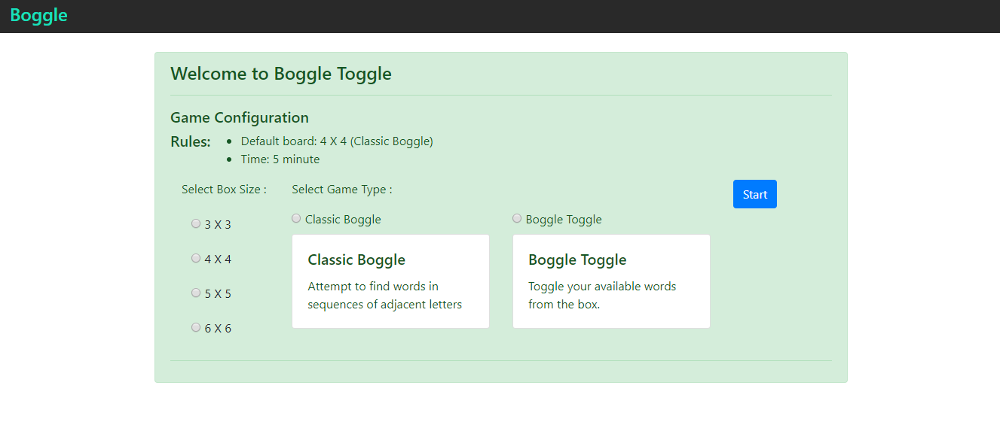
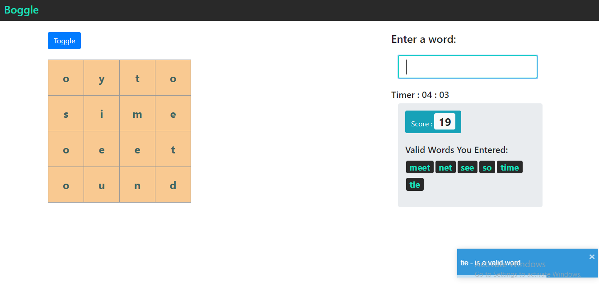

# Boggle Toggle

## What is this repository for?
Boggle Toggle game is built in Ruby on Rails using ReactJS.

## Used version

* Ruby version : ruby 2.6.5p114 (2019-10-01 revision 67812) [x64-mingw32]

* Rails version : Rails 6.0.2.2

* Yarn version : 1.22.4

## How do I set up for development (Assuming the above version are installed)
- Run `yarn install --check-files` to check that the package dependencies in the current project’s package.json match those in yarn’s lock file.
- Run `bundle install`
- Run `rails s` to run the game

## How to run the test suite
  - Test Script location : spec/
  - For rails API testing, use `bundle exec rspec spec/api_test.rb`
  - For frontend functionality testing, use `yarn test --coverage` 

## Screenshots

